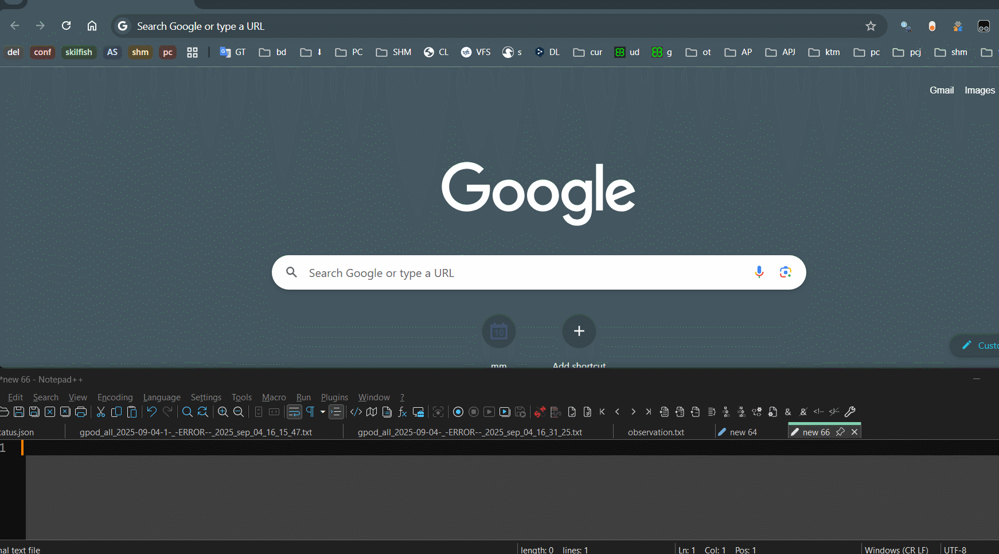

# Userscripts - The repository for Userscripts

This repository collects [userscripts](https://en.wikipedia.org/wiki/Userscript_manager) that make the life easier to work with JIRA & git sites.

Every change/improvements are welcome.

## Userscript managers

[Greasemonkey for Firefox](https://addons.mozilla.org/de/firefox/addon/greasemonkey/)

[Tampermonkey for chrome](https://chrome.google.com/webstore/detail/tampermonkey/dhdgffkkebhmkfjojejmpbldmpobfkfo?hl=de)

## Scripts

| Name                                                              | Description                                                                                                                                                                                                                                                                                                                                                                                                                                                                                                                     | Screenshot                                                  |
|-------------------------------------------------------------------|---------------------------------------------------------------------------------------------------------------------------------------------------------------------------------------------------------------------------------------------------------------------------------------------------------------------------------------------------------------------------------------------------------------------------------------------------------------------------------------------------------------------------------|-------------------------------------------------------------|
| [JiraLinkTitleIdcopy](JiraLinkTitleIdcopy/JiraCopyButton.user.js)               | Minimal Jira copy buttons for links, Title,  ID                                                                                                                                                                                                                                                                                                                                                                                                                                                       |                  |
| [GitClone](GitClone/GitCloneCopy.user.js)               | copy git clone commands with branch page                                                                                                                                                                                                                                                                                                                                                                                                                                                       |                  |

